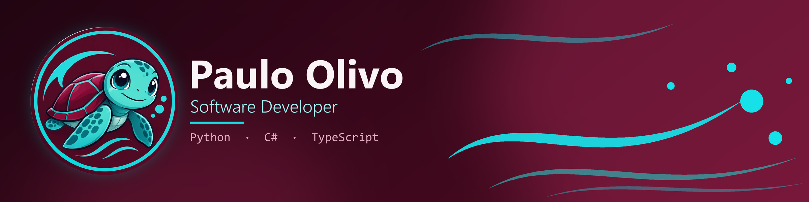

**Developer building web, mobile and API projects with Python, C# and TypeScript.**

 

##About Me

I'm a software developer who enjoys turning ideas into working products, from REST API consumers and CRUD apps to authentication flows and cross-platform mobile apps.

- 🔭 Currently working on **KITCHAN**, a team project for centralizing delivery orders. My part: JWT login and role-based route protection.
- 🌱 Building with **Python (Flask), C# / .NET MAUI, TypeScript (Next.js)** and SQL/NoSQL databases.
- 🚀 I practice deployment with **Vercel** and **Render**.
- 🤝 I work in teams using feature branches and pull requests.

 

##Tech Stack

**Languages**

**Frameworks & Platforms**

**Databases & Tools**

 

##Featured Projects

###[KITCHAN](https://github.com/Isaaidk/KITCHAN)

> **Centralized order management for digital delivery environments.**
> A platform that gathers orders from delivery apps (Uber Eats, Rappi, PedidosYa) into one real-time kitchen display.

**Team project** with [@Isaaidk](https://github.com/Isaaidk). My contributions:

- Implemented **login with JWT**, including the user's role in the token.
- Added **role-based route protection** and separate login screens for admin and operator.
- Added tests for the **delete-user** feature.

[**View repository →**](https://github.com/Isaaidk/KITCHAN)

 

### More projects

<table>
  <tr>
    <td width="50%" valign="top">
      <h4><a href="https://github.com/Paulolivo4/Login-CRUD-Flask">Login-CRUD-Flask</a></h4>
      
Flask web app with login/logout, user registration and full CRUD, organized in MVC layers with separate admin, client and restaurant-owner controllers. Connected to SQL Server through pyodbc.

      
  

      <a href="https://github.com/Paulolivo4/Login-CRUD-Flask">Code</a>
    </td>
    <td width="50%" valign="top">
      <h4><a href="https://github.com/Paulolivo4/catequesis_parroquial_MongoDB">catequesis_parroquial_MongoDB</a></h4>
      
Parish catechesis management project: Flask web app with MongoDB to register, search, edit and delete catechized users. Related Python MVC web interface: (<a href="https://github.com/Paulolivo4/BDD_Kp_InterfazWeb_Py">BDD_Kp_InterfazWeb_Py</a>).

      
  

      <a href="https://github.com/Paulolivo4/catequesis_parroquial_MongoDB">Code</a>
    </td>
  </tr>
  <tr>
    <td width="50%" valign="top">
      <h4><a href="https://github.com/Paulolivo4/MauiNasaAppPO">MauiNasaAppPO</a> · <a href="https://github.com/Paulolivo4/ApiNasaPO">ApiNasaPO</a></h4>
      
Two .NET MAUI apps that work with NASA&rsquo;s Astronomy Picture of the Day (APOD) data.

      
 

      <a href="https://github.com/Paulolivo4/MauiNasaAppPO">Code</a>
    </td>
    <td width="50%" valign="top">
      <h4><a href="https://github.com/Paulolivo4/CoctelesApiPO">CoctelesApiPO</a></h4>
      
.NET MAUI app that consumes a public cocktail API and lists the results.

      

      <a href="https://github.com/Paulolivo4/CoctelesApiPO">Code</a>
    </td>
  </tr>
  <tr>
    <td width="50%" valign="top">
      <h4><a href="https://github.com/Paulolivo4/ponextjsvercelworkshop2025">ponextjsvercelworkshop2025</a></h4>
      
Next.js workshop app deployed on Vercel, with authentication (NextAuth), a products API and Supabase integration.

      
 

      <a href="https://ponextjsvercelworkshop2025.vercel.app">Live demo</a> · <a href="https://github.com/Paulolivo4/ponextjsvercelworkshop2025">Code</a>
    </td>
    <td width="50%" valign="top">
      <h4><a href="https://github.com/Paulolivo4/novaflowlabs">novaflowlabs</a></h4>
      
Landing page for <b>NovaFlow Labs</b>, a web automation brand.

      

      <a href="https://github.com/Paulolivo4/novaflowlabs">Code</a>
    </td>
  </tr>
</table>

 

## 🎓 Certifications

| Certification | Issuer | Date | Verify |
| --- | --- | --- | --- |
| **Cloud Computing Fundamentals** | IBM SkillsBuild | Nov 2025 | [Credly](https://www.credly.com/badges/72816c14-4ead-4816-b548-39259dffccdc) |
| **Analista de datos con Power BI** *(Data Analyst with Power BI, 10 h)* | Udemy | Oct 2025 | [Certificate](https://ude.my/UC-d3f648e9-fba0-4a6c-80bf-961791f446b4) |
| **Gestión de proyectos - Proyectos pequeños** *(Project Management: Small Projects, 1.5 h)* | Udemy | Oct 2025 | [Certificate](https://ude.my/UC-34f14070-f824-4b99-bef6-1251f0b2236a) |
| **Creatividad e Innovación** *(Creativity and Innovation, 3 h)* | Udemy | Oct 2025 | [Certificate](https://ude.my/UC-9c35520e-3d8b-4174-b35c-d720a2767bad) |
| **Design Thinking - De Cero a Maestro** *(Design Thinking: Zero to Master, 2 h)* | Udemy | Apr 2024 | [Certificate](https://ude.my/UC-a6134a2a-4e2b-4c01-827b-8a1d634afe5d) |

 

##GitHub Stats

 

##Let's Connect

